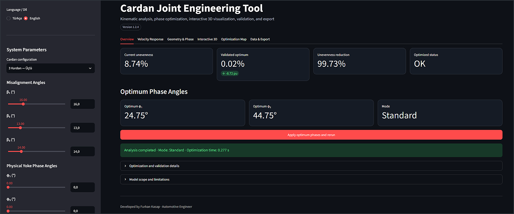
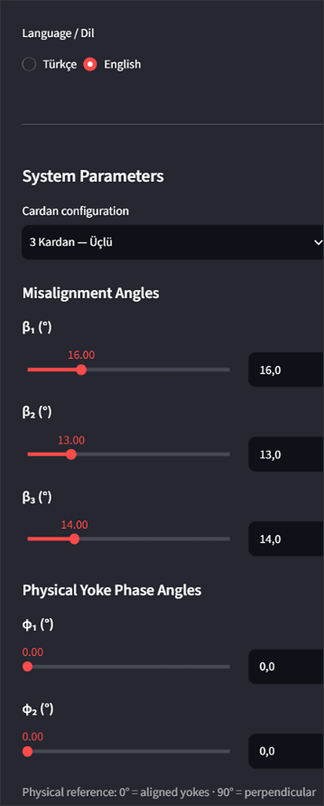
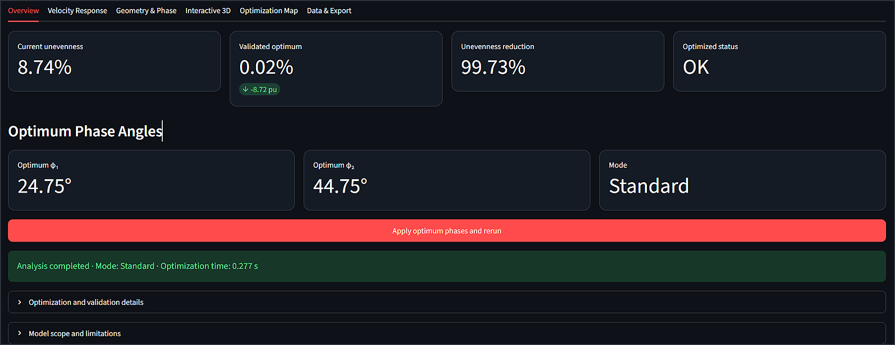
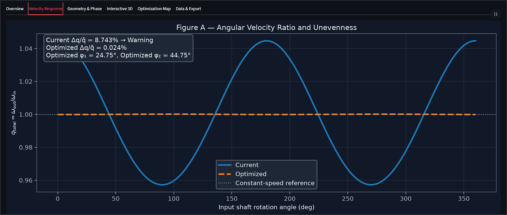
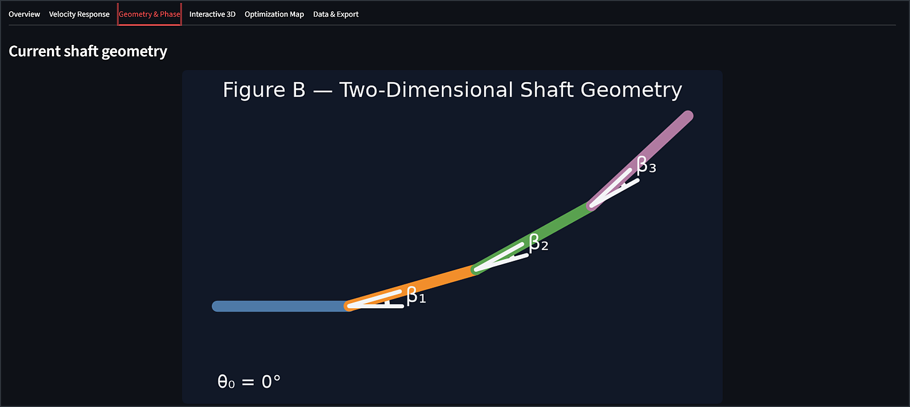
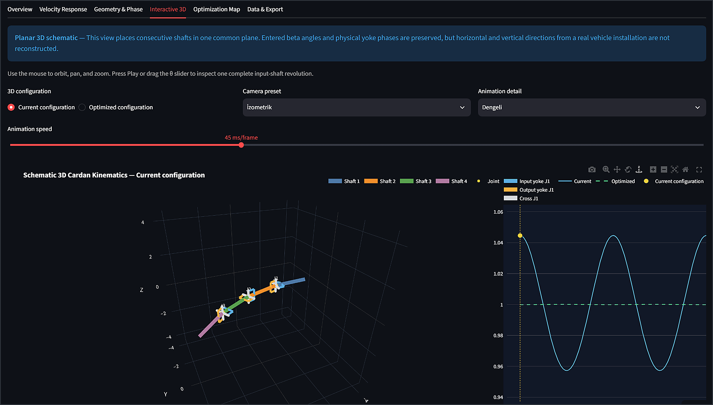
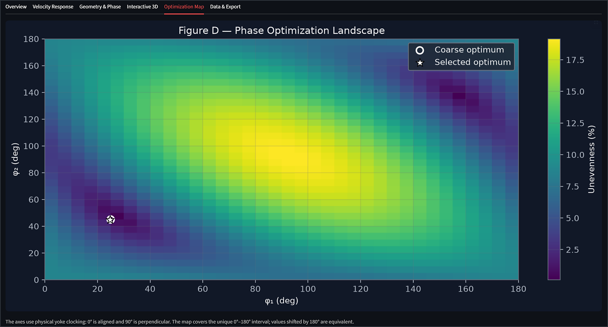
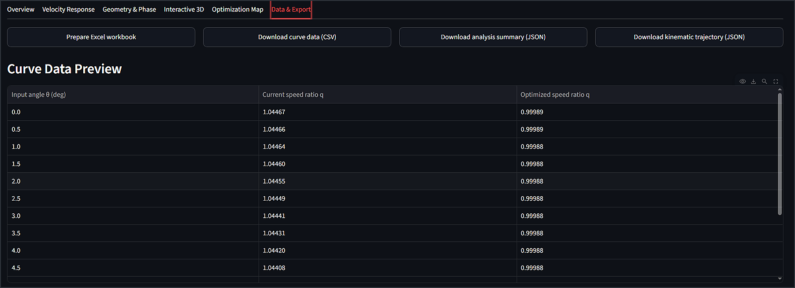

# Cardan Joint Engineering Tool

Interactive engineering application for the **kinematic analysis, physical yoke-phase optimization, visualization, validation, and export** of single, double, and triple Cardan (Hooke universal-joint) systems.


<p align="center">
  
</p>

<p align="center">
  <a href="https://cardanjoint-optimization-tool-v10-y4tdutpuvokj2u2m8sqfee.streamlit.app/">
    
  </a>
</p>

---

## Overview

The **Cardan Joint Engineering Tool** connects the analytical kinematics of Hooke universal joints with an interactive engineering workflow.

The user defines:

- the number of Cardan joints,
- shaft misalignment angles $\beta_i$,
- physical yoke clocking angles $\phi_i$,
- the input-shaft angular reference $\theta_0$,
- and the required optimization accuracy.

The application then:

1. propagates the angular position through each universal joint,
2. calculates the instantaneous speed ratio of every joint,
3. multiplies the individual ratios to obtain the final output response,
4. measures the remaining speed unevenness,
5. searches for a better physical yoke-phase configuration,
6. validates the selected solution on an independent angular grid,
7. and presents the result through engineering plots, an animated 3D schematic, and downloadable data files.

The project is designed to make phase compensation understandable both **numerically** and **visually**. It is suitable for education, preliminary driveline studies, algorithm comparison, and early-stage engineering evaluation.

> **Engineering scope:** the current model is kinematic. It does not calculate torque, bearing reactions, stress, fatigue, friction, backlash, shaft flexibility, efficiency, or torsional vibration.

---

## Key Capabilities

- Single, double, and triple Cardan-system analysis
- Physical yoke clocking convention:
  - $0^\circ$: adjacent yokes aligned
  - $90^\circ$: adjacent yokes perpendicular
- Instantaneous angular velocity ratio over a complete input-shaft revolution
- Current and optimized response comparison
- Four optimization methods
- Deterministic phase-map generation
- Sub-degree and continuous phase optimization
- Independent dense validation after optimization
- Current, optimized, and reduction metrics
- Two-dimensional shaft-geometry visualization
- Current and optimized yoke-phase diagrams
- Interactive Plotly/WebGL 3D animation
- Synchronized speed-ratio graph and moving input-angle marker
- English and Turkish interface
- Excel, CSV, analysis JSON, trajectory JSON, and 3D-scene JSON export

---

## How the Application Works

```text
User inputs
   ↓
Cardan angle propagation
   ↓
Individual joint speed ratios q₁, q₂, q₃
   ↓
Total speed ratio q_total
   ↓
Engineering metrics and phase landscape
   ↓
Phase optimization
   ↓
Independent dense validation
   ↓
Plots, 3D animation, diagnostics, and exports
```

For every evaluated input angle, the program calculates the output angle of each joint and uses it as the input reference of the following joint. The physical yoke phase shifts the angular reference between adjacent joints. This changes the relative timing of their periodic speed fluctuations.

A suitable phase configuration can make an accelerating contribution from one joint occur near a decelerating contribution from another. The residual output-speed fluctuation can therefore be reduced through **kinematic phase compensation**.

This is not damping and does not represent energy dissipation.

---

## Supported Configurations

| Configuration | Active misalignment angles | Active phase angles | Optimization |
|---|---|---|---|
| **1 Cardan — Single** | $\beta_1$ | None | Not applicable |
| **2 Cardan — Double** | $\beta_1,\beta_2$ | $\phi_1$ | One-variable phase optimization |
| **3 Cardan — Triple** | $\beta_1,\beta_2,\beta_3$ | $\phi_1,\phi_2$ | Two-variable phase optimization |

Controls that are not required by the selected configuration are hidden automatically.

---

# Interface Guide

## 1. Sidebar — System Parameters

<p align="center">
  
</p>

The sidebar is the main input area of the application.

| Control | Function |
|---|---|
| **Language / Dil** | Switches the complete interface between English and Turkish |
| **Cardan configuration** | Selects a single, double, or triple Cardan system |
| **$\beta_1,\beta_2,\beta_3$** | Defines the angular misalignment between consecutive shaft axes |
| **$\phi_1,\phi_2$** | Defines the physical clocking angle between adjacent yokes on the shared shaft |
| **$\theta_0$** | Shifts the initial angular reference of the input shaft |
| **Analysis quality** | Selects the normal deterministic workflow or the ultra continuous workflow |
| **Run analysis** | Executes a manual or ultra analysis when automatic updating is disabled |
| **Reset inputs** | Restores the default interface values |

### Misalignment-angle guidance

The interface permits:

```text
0° ≤ β ≤ 60°
```

- Above $30^\circ$, the application displays an informational warning because speed fluctuation and local nonlinearity may become more pronounced.
- Above $45^\circ$, a stronger warning is shown because the entered operating angle is high for many practical universal-joint applications.

These messages are engineering prompts, not universal design limits.

### Physical yoke-phase convention

The user-facing phase interval is:

```text
0° ≤ φ ≤ 180°
```

The slider includes $180^\circ$, but that value is kinematically equivalent to $0^\circ$. A $180^\circ$ yoke rotation produces the same kinematic orientation:

```math
\phi \equiv \phi+180^\circ
```

The interface therefore uses the unique physical interval from aligned to equivalent aligned orientation.

---

## 2. Overview Tab

<p align="center">
  
</p>

The **Overview** tab is the main engineering summary. It displays:

- current speed unevenness,
- optimized speed unevenness,
- percentage reduction,
- optimized status,
- optimum physical phase angles,
- analysis mode,
- execution time,
- and the **Apply optimum** command.

The **Apply optimum** button transfers the selected optimum phase values back to the sidebar and updates the visual configuration.

The expandable diagnostics panel reports:

- convergence status,
- function evaluations,
- iterations or generations,
- coarse candidate count,
- optimizer objective value,
- independently validated value,
- validation difference,
- coarse-grid solution,
- and the solver message.

> The `5%` status threshold is a project evaluation criterion. It must not be interpreted as a universal driveline-design standard.

---

## 3. Velocity Ratio Tab

<p align="center">
  
</p>

This tab compares the current and optimized responses over one complete input-shaft revolution.

The vertical axis is:

```math
q_{\mathrm{total}}=\frac{\omega_{\mathrm{out}}}{\omega_{\mathrm{in}}}
```

A perfectly constant-speed response would remain at:

```math
q_{\mathrm{total}}=1
```

The plot allows the user to inspect:

- periodic output-speed fluctuation,
- the amplitude of the current response,
- the amplitude after optimization,
- the phase shift between the two responses,
- and the remaining cancellation error.

---

## 4. Geometry & Phase Tab

<p align="center">
  
</p>

This tab contains two complementary visualizations.

### Two-dimensional shaft geometry

The geometry plot shows the selected shaft chain and labels the active $\beta$ angles. The number of shaft segments changes with the selected configuration:

| Configuration | Joints | Shaft segments |
|---|---:|---:|
| Single | 1 | 2 |
| Double | 2 | 3 |
| Triple | 3 | 4 |

### Current and optimized phase diagrams

For double and triple systems, the interface displays the current and optimized yoke orientations side by side.

The diagrams include:

- end-view clocking orientation,
- side-view yoke representation,
- phase magnitude,
- and clockwise/counterclockwise direction.

These figures are explanatory engineering schematics rather than detailed CAD models.

---

## 5. Interactive 3D Tab

<p align="center">
  
</p>

The interactive 3D viewer is built with Plotly WebGL. It combines an animated mechanism schematic with the calculated speed response.

The user can:

- switch between the current and optimized configuration,
- orbit, pan, and zoom the camera,
- select isometric, top, side, or front views,
- play one complete input-shaft revolution,
- drag the $\theta$ animation slider,
- change animation detail,
- change frame duration,
- and download the generated 3D scene data as JSON.

The graph beside the mechanism contains:

- the current speed-ratio curve,
- the optimized speed-ratio curve,
- a moving $q$ marker,
- and a synchronized vertical $\theta$ line.

> **3D-model limitation:** the viewer is a canonical planar engineering schematic. It preserves the entered $\beta$ values and physical yoke phases, but it does not reconstruct the unique horizontal and vertical arrangement of a real vehicle driveline from scalar $\beta$ values alone.

---

## 6. Phase Map Tab

<p align="center">
  
</p>

The deterministic coarse phase grid is visualized in this tab.

- For a **double Cardan** system, the graph shows unevenness as a function of $\phi_1$.
- For a **triple Cardan** system, the graph shows the two-dimensional landscape over $\phi_1$ and $\phi_2$.

The phase map is useful for understanding:

- whether the optimum lies in a narrow or broad region,
- whether multiple equivalent minima exist,
- how sensitive the result is to yoke clocking,
- and how the continuous optimum relates to the deterministic grid.

The displayed phase axes use the physical convention:

```text
0° = aligned yokes
90° = perpendicular yokes
```

---

## 7. Data Export Tab

<p align="center">
  
</p>

The application can generate the following files:

| Export | Contents |
|---|---|
| **Engineering workbook — XLSX** | Summary, inputs, current/optimized comparison, velocity curves, kinematic trajectory, phase landscape, and diagnostics |
| **Velocity curves — CSV** | Input angle, current ratio, optimized ratio, and associated curve data |
| **Analysis summary — JSON** | Parameters, optimum phases, metrics, and diagnostics |
| **Kinematic trajectory — JSON** | Joint input/output angles, individual ratios, total ratio, and trajectory data |
| **3D scene — JSON** | Shaft geometry, axes, rotations, quaternions, and selected scene state |

A numerical preview of the first curve samples is shown directly in the interface before download.

---

# Mathematical Model

## 1. Single Hooke Joint — Output Angle

For a universal joint with input angle $\theta_{\mathrm{in}}$ and shaft misalignment $\beta$, the analytical position relation is commonly written as:

```math
\tan\theta_{\mathrm{out}}
=
\frac{\tan\theta_{\mathrm{in}}}{\cos\beta}
```

The implementation uses the quadrant-preserving form:

```math
\theta_{\mathrm{out}}
=
\mathrm{atan2}
\left(
\sin\theta_{\mathrm{in}},
\cos\beta\cos\theta_{\mathrm{in}}
\right)
```

Using `atan2` prevents quadrant ambiguity when the shaft completes a full revolution.

---

## 2. Instantaneous Angular Velocity Ratio

The instantaneous speed ratio of one Hooke joint is:

```math
q(\theta,\beta)
=
\frac{\omega_{\mathrm{out}}}{\omega_{\mathrm{in}}}
=
\frac{\cos\beta}
{1-\sin^2\beta\cos^2\theta}
```

where:

- $\theta$ is the instantaneous joint input angle,
- $\beta$ is the angle between the two shaft axes,
- $q$ is the instantaneous output/input angular velocity ratio.

When $\beta=0^\circ$:

```math
q=1
```

and the joint transmits constant angular velocity in the ideal kinematic model.

---

## 3. Physical Phase Convention

The interface defines physical yoke phase as:

```text
φ = 0°  → adjacent yokes aligned
φ = 90° → adjacent yokes perpendicular
```

The analytical recurrence used internally has a shifted angular reference. The physical phase is converted through:

```math
\psi_i
=
\left(90^\circ-\phi_i\right)\bmod 180^\circ
```

where $\psi_i$ is the internal Hooke-angle reference used only inside the numerical recurrence.

The next joint input angle is then:

```math
\theta_{i+1,\mathrm{in}}
=
\theta_{i,\mathrm{out}}-\psi_i
```

This conversion keeps the user interface consistent with physical yoke clocking while preserving the analytical model used by the solver.

---

## 4. Double Cardan System

The first-joint response is:

```math
q_1=q(\theta_{1,\mathrm{in}},\beta_1)
```

The first output angle is propagated to the second joint:

```math
\theta_{2,\mathrm{in}}
=
\theta_{1,\mathrm{out}}-\psi_1
```

The total ratio becomes:

```math
q_{\mathrm{total}}
=
q_1q_2
```

or explicitly:

```math
q_{\mathrm{total}}(\theta,\phi_1)
=
q(\theta_{1,\mathrm{in}},\beta_1)
\,
q(\theta_{2,\mathrm{in}},\beta_2)
```

---

## 5. Triple Cardan System

For three consecutive joints:

```math
\theta_{2,\mathrm{in}}
=
\theta_{1,\mathrm{out}}-\psi_1
```

```math
\theta_{3,\mathrm{in}}
=
\theta_{2,\mathrm{out}}-\psi_2
```

The total instantaneous ratio is:

```math
q_{\mathrm{total}}
=
q_1q_2q_3
```

The phase variables do not change the $\beta$ angles. They change the angular positions at which the second and third joints generate their periodic speed fluctuations.

---

## 6. Speed-Unevenness Metric

The primary optimization metric is:

```math
U(\%)
=
100\frac{q_{\max}-q_{\min}}{|\bar q|}
```

where:

- $q_{\max}$ is the maximum total speed ratio,
- $q_{\min}$ is the minimum total speed ratio,
- $\bar q$ is the mean total speed ratio over the evaluated cycle.

A smaller value indicates a more uniform output-shaft speed.

---

## 7. Additional Engineering Metrics

The application also reports the root-mean-square speed error:

```math
E_{\mathrm{RMS}}(\%)
=
100\sqrt{
\frac{1}{N}
\sum_{k=1}^{N}
\left(
\frac{q_k}{|\bar q|}-1
\right)^2
}
```

Maximum positive deviation:

```math
E_{+}(\%)
=
100\frac{q_{\max}-\bar q}{|\bar q|}
```

Maximum negative deviation:

```math
E_{-}(\%)
=
100\frac{q_{\min}-\bar q}{|\bar q|}
```

The reported improvement is:

```math
R(\%)
=
100\frac{U_{\mathrm{current}}-U_{\mathrm{optimized}}}
{U_{\mathrm{current}}}
```

---

# Optimization Method

## Objective Function

For a double Cardan system:

```math
\phi_1^*
=
\underset{0^\circ\leq\phi_1<180^\circ}{\mathrm{arg\,min}}
\;U(\phi_1)
```

For a triple Cardan system:

```math
(\phi_1^*,\phi_2^*)
=
\underset{0^\circ\leq\phi_1,\phi_2<180^\circ}{\mathrm{arg\,min}}
\;U(\phi_1,\phi_2)
```

The misalignment angles remain fixed during one optimization run. Only the physical yoke phases are optimization variables.

## Fundamental Kinematic Period

The Hooke-joint speed response repeats every $180^\circ$. The optimizer therefore evaluates the unique half-revolution interval, while the result plot displays a complete $0^\circ$–$360^\circ$ input-shaft revolution.

The standard objective grid contains 360 uniformly distributed input positions over the $180^\circ$ kinematic period, retaining a $0.5^\circ$ angular spacing.

## Coarse Phase Landscape

A deterministic coarse phase map is generated for every double or triple optimization. For coarse phase step $s$:

```math
N_{\mathrm{double}}\approx\frac{180}{s}
```

```math
N_{\mathrm{triple}}\approx
\left(\frac{180}{s}\right)^2
```

The grid is retained even when a continuous optimizer is selected because it provides:

- a repeatable baseline,
- the visible phase landscape,
- an initial engineering candidate,
- and a safe fallback if a stochastic solution does not improve the deterministic result.

## Independent Dense Validation

After the optimizer selects a candidate, the current and optimized configurations are recalculated on a separate user-selectable angular grid.

The interface compares:

- the optimizer objective value,
- the dense-validation value,
- and their difference in percentage points.

The validated value is used in the main engineering-result cards.

---

# Optimization Modes

| Method | Search type | Main purpose |
|---|---|---|
| **Fast Grid** | Deterministic discrete search | Fast baseline and phase-map generation |
| **Grid + Local Refinement** | Deterministic coarse grid followed by periodic local search | Standard engineering analysis with sub-degree results |
| **Global Continuous — Differential Evolution** | Stochastic population-based global search | Continuous global exploration of the phase domain |
| **Hybrid — Differential Evolution + Powell** | Global Differential Evolution followed by derivative-free Powell refinement | Highest-accuracy engineering workflow |

### Standard analysis

The default standard workflow uses **Grid + Local Refinement**. It is deterministic, fast enough for interactive use, and updates automatically when live analysis is enabled.

### Ultra-accurate optimization

Ultra mode uses the **Hybrid — Differential Evolution + Powell** workflow. It searches continuous phase values, requires more computation, and is executed manually after input changes.

---

# Typical Workflow

1. Open the Streamlit application.
2. Select the interface language.
3. Choose the single, double, or triple Cardan configuration.
4. Enter the active $\beta$ angles.
5. Enter the current physical $\phi$ angles.
6. Set $\theta_0$ when a different angular starting reference is required.
7. Use the standard automatic analysis for quick evaluation.
8. Open **Overview** and inspect the current/optimized metrics.
9. Review the curves in **Velocity Ratio**.
10. Inspect the shaft and yoke arrangement in **Geometry & Phase**.
11. Use **Apply optimum** to transfer the optimized phases to the current configuration.
12. Compare current and optimized motion in **Interactive 3D**.
13. Inspect optimization sensitivity in **Phase Map**.
14. Run ultra optimization when a continuous high-accuracy result is required.
15. Download the engineering workbook or raw data from **Data Export**.

---

# Installation

## Windows Quick Setup

Run:

```text
install_windows.bat
```

Then launch the application with:

```text
run_windows.bat
```

## Manual Setup

Clone the repository:

```bash
git clone https://github.com/furk4nkasap/Cardanjoint-optimization-tool-v1.0.git
cd Cardanjoint-optimization-tool-v1.0
```

Install the dependencies:

```bash
python -m pip install -r requirements.txt
```

Start Streamlit:

```bash
python -m streamlit run streamlit_app.py
```

## Main Dependencies

```text
streamlit
numpy
matplotlib
scipy
plotly
XlsxWriter
```

---

# Project Structure

```text
Cardanjoint-optimization-tool-v1.0/
│
├── images/
│   ├── 01-hero-dashboard.png
│   ├── 02-sidebar-controls.png
│   ├── 03-overview-tab.png
│   ├── 04-velocity-ratio.png
│   ├── 05-geometry-and-phase.png
│   ├── 06-interactive-3d.png
│   ├── 07-phase-map.png
│   └── 08-data-export.png
│
├── cardan_core.py
├── cardan_3d_viewer.py
├── streamlit_app.py
├── benchmark_optimizers.py
├── requirements.txt
├── install_windows.bat
├── run_windows.bat
├── tests/
├── CHANGELOG.md
├── LICENSE
└── README.md
```

---

# Model Scope and Limitations

The software treats the shafts and Cardan joints as ideal rigid kinematic elements.

The current version does **not** include:

- mass or rotational inertia,
- transmitted torque,
- bearing or joint reaction loads,
- friction or mechanical losses,
- backlash or clearance,
- shaft flexibility,
- stress or fatigue,
- joint efficiency,
- torsional natural frequencies,
- torsional vibration,
- power loss,
- thermal behavior,
- or a general spatial driveline reconstruction.

The application should not be used as the sole basis for production design. Production decisions require additional geometric verification, multibody dynamics, structural analysis, component data, and physical testing.

---

# Advanced Settings Reference

The **Advanced settings** panel exposes the controls used to balance speed, repeatability, and numerical accuracy.

## 1. Ultra-Accurate Optimization

Enables the continuous high-accuracy workflow.

- Default algorithm: **Hybrid — Differential Evolution + Powell**
- Best suited for: final phase selection and difficult optimization landscapes
- Behavior: results are not refreshed automatically after every input change; the user runs the analysis manually
- Trade-off: higher computational cost than standard analysis

## 2. Use Precise 0.01° Angle Controls

Changes the direct angle inputs from the normal interface resolution to $0.01^\circ$.

This affects the values entered for:

- $\beta_i$,
- $\phi_i$,
- and $\theta_0$.

Full floating-point precision is retained internally and in exported files regardless of the displayed interface formatting.

## 3. Update Standard Analysis Automatically

When enabled, a standard analysis is recalculated when a relevant system parameter changes.

Recommended for:

- rapid parameter exploration,
- classroom demonstrations,
- and visual comparison of nearby configurations.

Disable it when repeated recalculation is undesirable or when many parameters will be changed consecutively.

## 4. Show Expert Algorithm Controls

Unlocks direct access to all four optimization methods.

Without expert mode:

- Standard analysis selects **Grid + Local Refinement**.
- Ultra analysis selects **Hybrid — Differential Evolution + Powell**.

With expert mode, the user can select each algorithm independently for research, benchmarking, or reproducibility studies.

## 5. Coarse Map Step

Range:

```text
1° ≤ coarse step ≤ 15°
```

Default:

```text
5°
```

This value controls the spacing of the deterministic phase grid.

- Smaller step: denser phase map, more candidate combinations, longer calculation
- Larger step: faster map, lower discrete resolution

The coarse map is generated even when a continuous method is selected.

## 6. Local Refinement Step

Available values:

```text
0.05°, 0.10°, 0.25°, 0.50°, 1.00°
```

The local-refinement method searches a periodic neighborhood around the best coarse-grid candidate.

- Smaller value: finer deterministic result, more local evaluations
- Larger value: faster refinement, lower local resolution

Default:

```text
0.25°
```

## 7. Optimization Method

Visible in expert mode.

### Fast Grid

- deterministic,
- fastest method,
- always generates the phase map,
- result is restricted to coarse-grid nodes.

### Grid + Local Refinement

- deterministic,
- starts from the best coarse candidate,
- searches a periodic local neighborhood,
- supports sub-degree phase values,
- does not claim a continuous global optimum.

### Global Continuous — Differential Evolution

- stochastic global search,
- works with continuous phase variables,
- uses a population of candidate solutions,
- repeatable when the same random seed is used,
- retains the deterministic coarse result if it is better.

### Hybrid — Differential Evolution + Powell

- performs global exploration with Differential Evolution,
- then applies bounded derivative-free Powell refinement,
- suitable for the non-smooth max/min-based unevenness objective,
- retains the coarse map and deterministic fallback,
- recommended when the highest available phase accuracy is required.

## 8. Maximum Generations

Range:

```text
5 to 500
```

Default:

```text
80
```

Controls the maximum number of Differential Evolution generations.

- Higher value: more global-search opportunity, longer runtime
- Lower value: faster analysis, greater risk of early termination

## 9. Population Multiplier

Range:

```text
4 to 40
```

Default:

```text
12
```

Controls the Differential Evolution population size relative to the number of optimization variables.

- Larger population: broader exploration, more function evaluations
- Smaller population: faster search, lower global diversity

## 10. Convergence Tolerance

Available values:

```text
1e-4, 1e-6, 1e-7, 1e-8
```

Default:

```text
1e-7
```

Defines the convergence sensitivity of Differential Evolution.

- Smaller tolerance: stricter convergence requirement
- Larger tolerance: earlier convergence and shorter runtime

The tolerance does not replace independent dense validation.

## 11. Random Seed

Default:

```text
42
```

The seed controls the stochastic initialization of Differential Evolution.

Using the same:

- system parameters,
- algorithm settings,
- software version,
- and random seed

supports repeatable optimizer behavior.

Changing the seed can be useful when comparing independent global-search runs.

## 12. Enable SciPy Polish

Enables SciPy's built-in polishing stage after Differential Evolution.

It can improve the final continuous candidate but adds extra function evaluations. The hybrid method also performs its own bounded Powell refinement as part of the project workflow.

## 13. Independent Validation Samples

Available values:

```text
360, 720, 1,800, 3,600, 7,200, 18,000
```

Typical defaults:

```text
Standard analysis: 1,800
Global/Ultra analysis: 7,200
```

This setting controls the density of the independent validation grid used after optimization.

- More samples: stronger numerical verification, longer validation time
- Fewer samples: faster result confirmation, lower validation density

The validated unevenness is displayed separately from the optimizer objective, allowing the user to detect sensitivity to angular sampling.

---

## Author

**Furkan Kasap**  
Automotive Engineer

GitHub: [furk4nkasap](https://github.com/furk4nkasap)

---

## License

This project is distributed under the **MIT License**.

See the [LICENSE](LICENSE) file for details.
