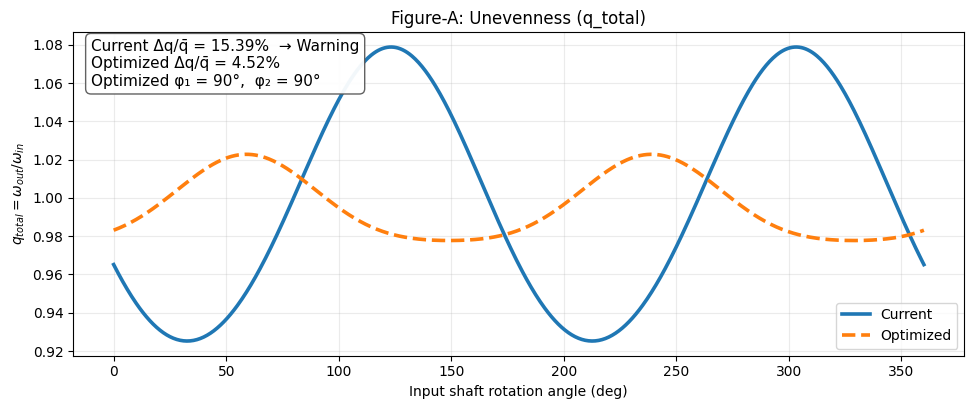
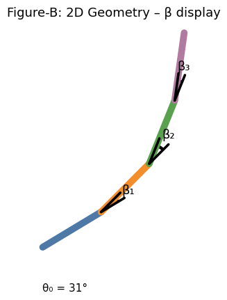
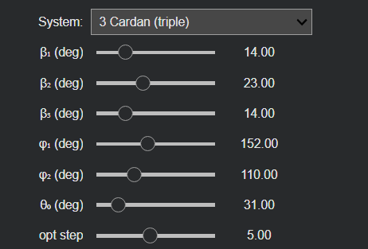
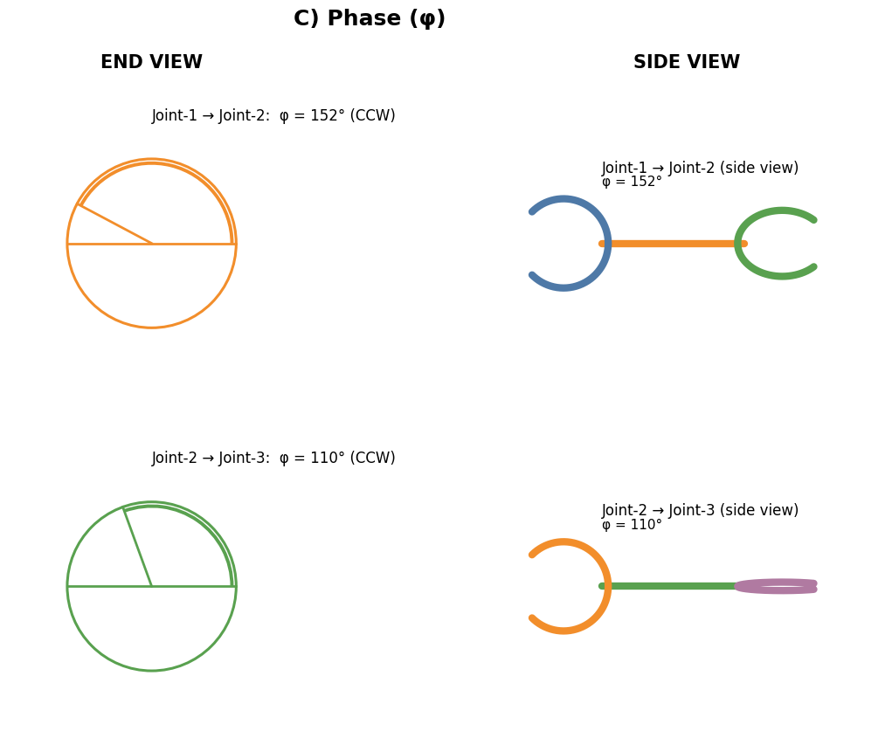

# Cardan Joint Kinematics & Phase Optimization Tool

Interactive Python application for the **kinematic analysis, visualization, and phase optimization** of single, double, and triple Cardan (Hooke's universal joint) systems.


---

## Overview

The **Cardan Joint Kinematics & Phase Optimization Tool** is an interactive engineering application developed in Python to evaluate the kinematic behavior of single, double, and triple Cardan joint systems.

The application calculates the instantaneous angular velocity ratio

\[
q_{total}=\frac{\omega_{out}}{\omega_{in}}
\]

throughout one complete input-shaft revolution.

For double and triple Cardan configurations, the application automatically searches for the phase or clocking angles that minimize angular velocity unevenness.

The tool also provides:

- Angular velocity ratio plots
- Current and optimized result comparison
- Two-dimensional shaft geometry visualization
- Misalignment-angle visualization
- End-view and side-view phase representations
- An interactive Jupyter/Google Colab interface

> This project performs a **kinematic analysis**. Mass, inertia, torque, bearing loads, elasticity, and dynamic forces are not included in the current version.

---

## Main Result

### Figure A — Angular Velocity Ratio and Unevenness

The following figure compares the angular velocity ratio of the current configuration with the result obtained after phase optimization.

<p align="center">
  
</p>

The unevenness metric is calculated as:

\[
\text{Unevenness}=
100\frac{q_{max}-q_{min}}{\bar{q}}
\]

where:

- \(q_{max}\) is the maximum angular velocity ratio,
- \(q_{min}\) is the minimum angular velocity ratio,
- \(\bar{q}\) is the mean angular velocity ratio.

The current software classifies an unevenness value of **5% or lower** as `OK`. Values above this limit are displayed as `Warning`.

For the example shown in Figure A:

- Current unevenness: **15.39%**
- Optimized unevenness: **4.52%**
- Optimized phase angles: **φ₁ = 90° and φ₂ = 90°**

To reproduce the optimized curve for this particular example, the phase-angle inputs should be set to:

```text
φ₁ = 90°
φ₂ = 90°
```

These phase values are **not universal constants**. They are valid only for the selected Cardan configuration and misalignment-angle inputs.

For a different shaft geometry or a different set of β angles, the optimum values may be different, for example:

```text
φ₁ = 15°
φ₂ = 25°
```

The application recalculates the optimum phase combination automatically for every selected configuration.

---

## Features

- Single Cardan joint analysis
- Double Cardan joint analysis
- Triple Cardan joint analysis
- Instantaneous angular velocity ratio calculation
- Full-cycle analysis from `0°` to `360°`
- Current and optimized curve comparison
- Velocity unevenness calculation
- Automatic phase-angle optimization
- Adjustable optimization step size
- Interactive parameter control using `ipywidgets`
- Two-dimensional shaft geometry visualization
- Misalignment-angle visualization
- End-view phase visualization
- Side-view yoke visualization
- Google Colab and Jupyter Notebook compatibility
- Turkish and English user guidance

---

## Supported Configurations

### 1 Cardan — Single Joint

The single Cardan mode evaluates one universal joint.

Active parameters:

- β₁: Misalignment angle
- θ₀: Initial angular reference

There is no phase-angle optimization in this configuration because only one joint is present.

---

### 2 Cardan — Double Joint

The double Cardan mode evaluates two consecutive universal joints.

Active parameters:

- β₁
- β₂
- φ₁
- θ₀
- Optimization step

The software propagates the angular position through the first joint, applies the phase angle `φ₁`, and then calculates the second-joint velocity ratio.

The total ratio is:

\[
q_{total}=q_1q_2
\]

The optimizer scans `φ₁` and selects the value that produces the minimum unevenness.

---

### 3 Cardan — Triple Joint

The triple Cardan mode evaluates three consecutive universal joints.

Active parameters:

- β₁
- β₂
- β₃
- φ₁
- φ₂
- θ₀
- Optimization step

The angular position is propagated sequentially through all three joints.

The total ratio is:

\[
q_{total}=q_1q_2q_3
\]

The optimizer scans combinations of `φ₁` and `φ₂` and selects the combination with the minimum unevenness.

---

## Interactive User Interface

The application provides an interactive interface for configuring the Cardan system and observing the effect of each parameter.

<p align="center">
  
</p>

The interface contains the following controls:

| Parameter | Description |
|---|---|
| `System` | Selects single, double, or triple Cardan configuration |
| `β₁, β₂, β₃` | Misalignment angles between consecutive shafts |
| `φ₁, φ₂` | Relative phase or clocking angles between adjacent joints |
| `θ₀` | Initial angular reference of the input shaft |
| `opt step` | Angular increment used during phase optimization |

Controls that are not required for the selected configuration are hidden automatically.

---

## Parameter Definitions

### Misalignment Angles — β

The parameters `β₁`, `β₂`, and `β₃` define the angular misalignment between consecutive shaft segments.

The current interface permits values between:

```text
0° ≤ β ≤ 60°
```

Increasing the misalignment angle generally increases the angular velocity fluctuation produced by an individual Cardan joint.

---

### Phase Angles — φ

The parameters `φ₁` and `φ₂` define the relative angular orientation of adjacent yokes around the shaft axis.

The current interface permits values between:

```text
0° ≤ φ ≤ 360°
```

The phase angle determines how the velocity fluctuations generated by consecutive Cardan joints interact.

Depending on the shaft geometry, an appropriate phase combination can partially or significantly cancel the total velocity ripple.

---

### Initial Angular Reference — θ₀

The parameter `θ₀` shifts the starting angular reference of the input shaft.

The current interface permits values between:

```text
0° ≤ θ₀ ≤ 180°
```

It changes the angular position at which the plotted cycle begins. Because the unevenness calculation covers a complete `0°–360°` revolution, shifting the angular reference does not normally change the full-cycle maximum-to-minimum unevenness.

---

### Optimization Step — opt step

The optimization step determines the angular resolution of the brute-force phase search.

The current interface permits:

```text
1° ≤ opt step ≤ 10°
```

A smaller step provides a finer search but requires more computation time.

Examples:

```text
opt step = 10°  → Faster, lower angular resolution
opt step = 5°   → Balanced search
opt step = 1°   → Finer search, longer calculation time
```

The optimization result can only occur at a phase value included in the selected scan grid.

For example, when:

```text
opt step = 5°
```

the optimizer evaluates:

```text
0°, 5°, 10°, 15°, ..., 355°, 360°
```

Therefore, a true optimum located between two scan points may be approximated by the closest evaluated value.

---

## Optimization Method

The current version uses a **brute-force phase scan**.

### Double Cardan

For each candidate value of `φ₁`:

1. Calculate the complete angular velocity ratio curve.
2. Calculate the unevenness percentage.
3. Compare the result with the best previous result.
4. Retain the phase angle with the lowest unevenness.

### Triple Cardan

For each candidate combination of `φ₁` and `φ₂`:

1. Calculate the complete angular velocity ratio curve.
2. Calculate the unevenness percentage.
3. Compare the result with the best previous result.
4. Retain the phase-angle combination with the lowest unevenness.

The search interval is:

```text
0° to 360°
```

The computational cost increases significantly for the triple Cardan configuration because every `φ₁` value is evaluated together with every `φ₂` value.

For an optimization step \(s\), the approximate number of phase combinations is:

\[
N=\left(\frac{360}{s}+1\right)^2
\]

for a triple Cardan system.

---

## Kinematic Model

For a single Hooke's universal joint, the instantaneous angular velocity ratio is calculated using:

\[
q=
\frac{\omega_{out}}{\omega_{in}}
=
\frac{\cos\beta}
{1-\sin^2\beta\cos^2\theta}
\]

where:

- \(\beta\) is the shaft misalignment angle,
- \(\theta\) is the instantaneous input-shaft angle,
- \(q\) is the instantaneous angular velocity ratio.

The angular position relation is:

\[
\tan\theta_{out}
=
\tan\theta_{in}\cos\beta
\]

For multiple Cardan joints, the output angle of one joint is propagated as the input angle of the next joint after applying the relevant phase angle.

This sequential propagation is used for both double and triple Cardan configurations.

---

## Figure B — Two-Dimensional Shaft Geometry

The two-dimensional geometry view illustrates the shaft arrangement and displays the β misalignment angles between consecutive shaft segments.

<p align="center">
  
</p>

The number of shaft segments depends on the selected system:

| Configuration | Number of joints | Number of shaft segments |
|---|---:|---:|
| Single Cardan | 1 | 2 |
| Double Cardan | 2 | 3 |
| Triple Cardan | 3 | 4 |

Each shaft is displayed using a different color to improve visual separation.

---

## Figure C — Phase Visualization

The phase visualization presents the relative clocking angle between adjacent Cardan joints.

<p align="center">
  
</p>

### End View

The end view displays:

- The phase reference line
- The relative yoke orientation
- The phase angle in degrees
- Clockwise or counterclockwise direction

### Side View

The side view provides a simplified visual interpretation of yoke orientation.

As the phase angle changes, the moving yoke representation transitions between:

```text
Circle-like → Ellipse-like → Line-like
```

Typical interpretations are:

```text
φ = 0°, 180°, 360°  → Face-on representation
φ = 90°, 270°       → Edge-on representation
```

The side-view figure is a schematic representation intended to clarify phase orientation. It is not a detailed three-dimensional CAD model of the joint.

---

## How to Use

1. Open the notebook in Google Colab or Jupyter Notebook.
2. Run all cells.
3. Select the Cardan configuration.
4. Enter the shaft misalignment angles.
5. Enter the current phase angles.
6. Select the optimization step.
7. Review the current and optimized curves in Figure A.
8. Read the optimized phase values from the information box.
9. Enter the optimized phase values into the `φ₁` and `φ₂` controls to visualize the optimized joint orientation.
10. Review the shaft geometry and phase diagrams.

---

## Run in Google Colab

[](https://colab.research.google.com/drive/1NyxubyRDLaJGNz_JJNoXK1A_juKGQTf5?usp=sharing)

---

## Local Installation

Clone the repository:

```bash
git clone https://github.com/furk4nkasap/Cardanjoint-optimization-tool-v1.0.git
```

Enter the project directory:

```bash
cd Cardanjoint-optimization-tool-v1.0
```

Install the required packages:

```bash
pip install numpy matplotlib ipywidgets
```

Alternatively, when a `requirements.txt` file is available:

```bash
pip install -r requirements.txt
```

Start Jupyter Notebook:

```bash
jupyter notebook
```

Then open the project notebook and run all cells.

---

## Requirements

The application uses the following Python libraries:

```text
numpy
matplotlib
ipywidgets
```

Recommended `requirements.txt` content:

```text
numpy
matplotlib
ipywidgets
notebook
```

---

## Project Structure

```text
Cardanjoint-optimization-tool-v1.0/
│
├── images/
│   ├── figure-a-velocity-ripple.png
│   ├── interface.png
│   ├── geometry.png
│   └── phase-visualization.png
│
├── CardanJoint_Optimization.ipynb
├── requirements.txt
├── LICENSE
└── README.md
```

---

## Current Limitations

The current version:

- Uses a discrete brute-force phase search
- Does not use gradient-based or continuous optimization
- Treats the shafts and joints as ideal rigid kinematic elements
- Does not calculate transmitted torque
- Does not calculate bearing reaction forces
- Does not include joint friction
- Does not include backlash or clearance
- Does not include shaft flexibility
- Does not calculate torsional natural frequencies
- Does not perform stress or fatigue analysis
- Does not include efficiency or power-loss calculations
- Uses a schematic rather than three-dimensional phase visualization

---

## Future Work

Planned improvements may include:

- Continuous phase optimization
- Faster optimization algorithms
- Optimization progress indication
- CSV and Excel result export
- Automatic report generation
- Three-dimensional shaft visualization
- Torque-transmission analysis
- Joint efficiency calculation
- Bearing reaction-force calculation
- Flexible shaft modeling
- Torsional vibration analysis
- Natural-frequency analysis
- Multiple optimization objectives
- Parameter-sweep studies
- Integration with multibody dynamics software

---

## Engineering Scope

This application is intended for:

- Educational studies
- Preliminary Cardan shaft configuration analysis
- Kinematic phase-angle investigation
- Visualization of universal-joint behavior
- Comparison of single, double, and triple Cardan layouts
- Early-stage engineering evaluation

The software should not be used as the sole basis for production design without additional validation, dynamic analysis, structural analysis, and physical testing.

---

## Author

**Furkan Kasap**  
Automotive Engineer  
Kocaeli University

GitHub: [furk4nkasap](https://github.com/furk4nkasap)

---

## License

This project can be distributed under the MIT License.

Add a `LICENSE` file to the repository before displaying an MIT License badge or formally publishing the project under that license.
